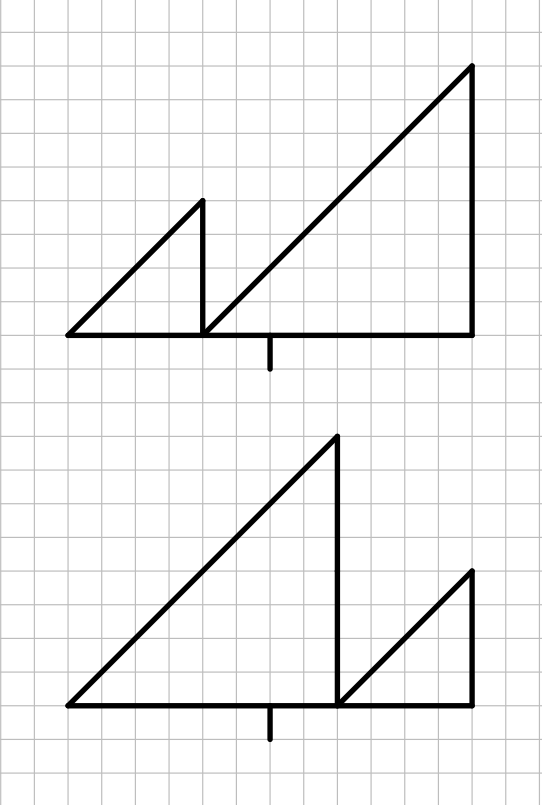

# Find Minimum in Rotated Sorted Array (Problem 153)

Binary Search.



```cpp
class Solution {
   public:
    int findMin(vector<int>& nums) {
        if (nums.front() <= nums.back()) return nums.front();

        int begin = 0;
        int end = nums.size() - 1;
        while (begin <= end) {
            int mid = (begin + end) / 2;
            if (mid && nums[mid - 1] > nums[mid])
                return nums[mid];
            else if (nums[mid] > nums[end])
                begin = mid + 1;
            else
                end = mid - 1;
        }
        return INT_MIN;
    }
};
```

