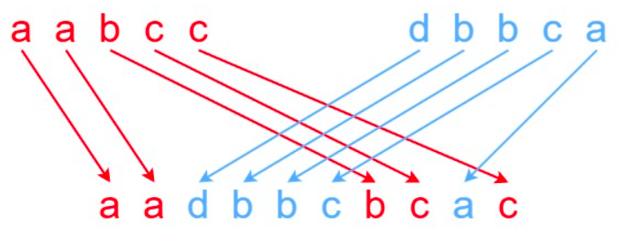

# Interleaving String (Problem 97)

2D dp `//revisit`



```cpp
class Solution {
   public:
    bool isInterleave(string s1, string s2, string s3) {
        int M = s1.size();
        int N = s2.size();
        if (s3.size() != M + N) return false;
        int table[M + 1][N + 1];

        for (int i = 0; i <= M; i++) {
            for (int j = 0; j <= N; j++) {
                if (!i && !j)
                    table[i][j] = true;
                else if (!i)
                    table[i][j] = table[i][j - 1] && s2[j - 1] == s3[i + j - 1];
                else if (!j)
                    table[i][j] = table[i - 1][j] && s1[i - 1] == s3[i + j - 1];
                else
                    table[i][j] =
                        (table[i][j - 1] && s2[j - 1] == s3[i + j - 1]) ||
                        (table[i - 1][j] && s1[i - 1] == s3[i + j - 1]);
            }
        }
        for(auto& v: table) {
            for(auto n: v)
                cout << >>
        }
        return table[M][N];
    }
};
```

| i \ j |     | d   | b   | b   | c   | a   |
| ----- | --- | --- | --- | --- | --- | --- |
|       | 1   | 0   | 0   | 0   | 0   | 0   |
| a     | 1   | 0   | 0   | 0   | 0   | 0   |
| a     | 1   | 1   | 1   | 1   | 1   | 0   |
| b     | 0   | 1   | 1   | 0   | 1   | 0   |
| c     | 0   | 0   | 1   | 1   | 1   | 1   |
| c     | 0   | 0   | 0   | 1   | 0   | 1   |

string1: aabcc  
string2: dbbca  
target: aadbbcbcac

can do this with 1D dp too since we need only remember the previous row and
previous element from current row.

```cpp
//later
```
